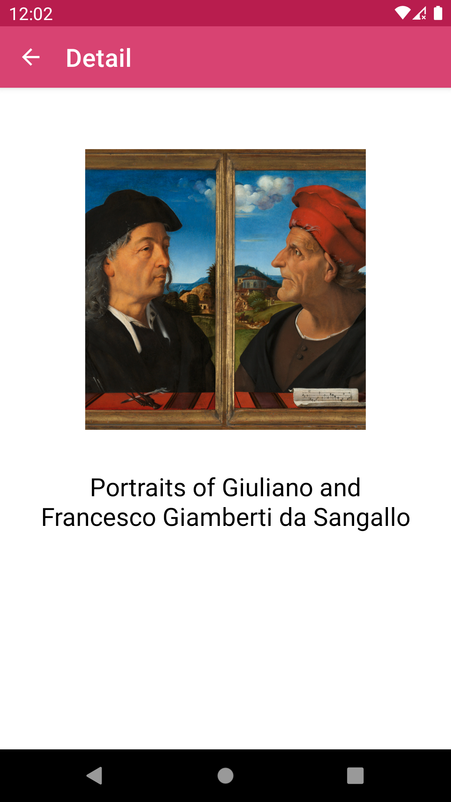

## Tada Assignment  
 

  

## Download APK -> [Debug APK](fauzimd-tada-assignment-debug.apk)

 

## Architecture
- Clean Architecture  
    - Package naming and organization follows Clean Architecture layering which are `data, domain, and presentation`
    - Using Repository Pattern
- MVVM & MVI  
BaseViewModel implementation inspired by MVVM & MVI

## Technology
- Language: Kotlin
- Dependency Injection: Dagger Hilt
- Background Jobs: Coroutines
- Networking: OkHttp, Retrofit, Gson
- Image Loader: Glide

## Testing
#### Unit Test  
- [ArtRepositoryTest](app/src/test/java/dev/illwiz/tada/ArtRepositoryTest.kt)
- [LoginViewModelTest](app/src/test/java/dev/illwiz/tada/LoginViewModelTest.kt)

#### UI Test  
- [LoginFragmentTest](app/src/androidTest/java/dev/illwiz/tada/login/LoginFragmentTest.kt)